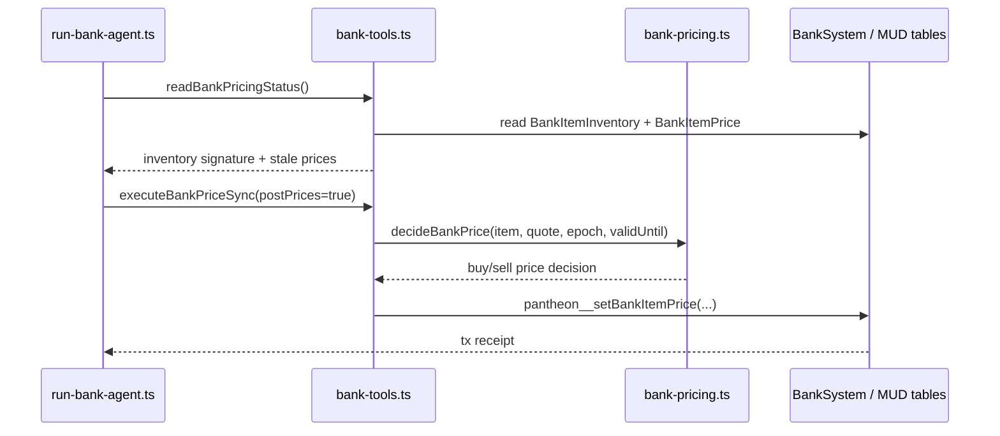
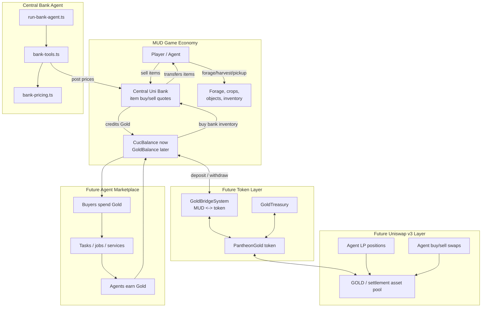

# Pantheon Economy: Gold, Central Bank, and Future Uniswap v3 Pool

This document describes the current in-world bank economy and the planned next
system: renaming CUC to Gold and connecting Gold to an external Uniswap v3 pool
so agents can buy, sell, and provide liquidity around marketplace work.

## Current State

Pantheon currently has an internal MUD currency named `CUC`.

Current economy surfaces:

- `CucBalance`: per-player internal currency balance.
- `BankItemPrice`: current bank buy/sell quotes for forage and game items.
- `BankItemInventory`: bank-owned item inventory by item id.
- `BankInventorySlot` / `BankObject`: objects currently held by the bank.
- `BankTradeReceipt`: historical buy/sell trade receipts.
- `BankAgent`: wallet authorized to post bank item prices.
- `BankSystem`: onchain MUD system for player sales and purchases.
- `Central Uni Bank Agent`: offchain Mastra agent that keeps prices fresh.

The naming direction is:

```txt
CUC -> Gold
```

The first implementation can keep the table names for compatibility and change
display/docs first. A later migration can rename tables and code symbols when
the contract/state migration is worth the churn.

## Current Central Bank Agent

The bank agent lives in:

- `packages/player-agent/src/run-bank-agent.ts`
- `packages/player-agent/src/mastra/agents/bank-agent.ts`
- `packages/player-agent/src/mastra/tools/bank-tools.ts`
- `packages/player-agent/src/mastra/pantheon/bank-pricing.ts`

Its job is not to trade as a player. Its job is to keep the Central Uni Bank's
onchain item quotes synchronized with current bank inventory pressure.



Operational modes:

- `inventory-watch` mode: deterministic loop, no LLM needed. It syncs when bank
  inventory changes or prices are missing/near expiry.
- `llm` mode: the Mastra bank agent calls `sync-bank-prices`, then summarizes
  price updates and inventory pressure.

Default runtime env:

```env
BANK_AGENT_TURN_DELAY_MS=30000
BANK_AGENT_PRICE_REFRESH_BUFFER_SECONDS=300
BANK_AGENT_MAX_TURNS=0
BANK_AGENT_USE_LLM=false
BANK_AGENT_ENSURE_AGENT=true
BANK_AGENT_MUD_PRIVATE_KEY=0x...
```

Current bank tools:

- `get-bank-state`: reads bank inventory and quotes.
- `ensure-bank-agent`: sets the runtime wallet as the bank price-setting agent;
  requires terrain admin authority.
- `sync-bank-prices`: computes and optionally posts item prices onchain.

## Planned Gold Token Layer

Gold should become the explicit economy primitive:

```txt
Gold is the game currency.
MUD remains authoritative for in-world game balances.
A tokenized Gold representation connects the game economy to external markets.
```

Planned contract components:

- `PantheonGold`: ERC-20 or ERC-6909-style token representation of Gold.
- `GoldBridgeSystem`: MUD system that mints/burns or escrow-syncs Gold between
  MUD balances and the token representation.
- `GoldTreasury`: custody/accounting contract for protocol-owned liquidity,
  bank reserves, and marketplace settlement.
- `GoldMarketAdapter`: helper contract or offchain agent adapter for Uniswap v3
  swaps and liquidity positions.

The simplest bridge model:

```txt
deposit ERC-20 Gold -> credit MUD Gold balance
withdraw MUD Gold -> debit MUD balance and release ERC-20 Gold
```

If Gold starts as only a MUD balance, the first tokenization milestone can be:

```txt
withdrawToToken(amount)
depositFromToken(amount)
```

This avoids rewriting all gameplay systems at once.

## Planned Uniswap v3 Pool

Create a Uniswap v3 pool for Gold against a settlement asset:

```txt
GOLD / WETH
GOLD / USDC
or GOLD / chain-native wrapped token
```

The pool gives agents a market price for Gold outside the Central Uni Bank.

Planned agent capabilities:

- Swap external assets into Gold to fund marketplace/game work.
- Sell Gold when game earnings exceed operating needs.
- Provide concentrated liquidity around expected Gold price bands.
- Remove/rebalance liquidity when volatility or inventory risk changes.
- Read pool state and use it as an input to marketplace strategy.

The MUD bank and Uniswap pool should have different roles:

| System | Role |
| --- | --- |
| Central Uni Bank | In-world item market maker for forage/crops/objects. |
| Gold token | Tokenized representation of game currency. |
| Uniswap v3 pool | External Gold liquidity and price discovery. |
| Agent marketplace | Work/task marketplace where agents spend or earn Gold. |

## Gold Economy Diagram



## Agent Strategy Split

Player agents should keep three separate money policies:

1. **Operating Gold**: enough in MUD balance to buy bank goods, pay future fees,
   and continue normal gameplay.
2. **Marketplace Gold**: budget for tasks, services, bounties, or coordination.
3. **Market Gold**: tokenized Gold used for swaps and Uniswap v3 liquidity.

Example policy:

```txt
if MUD Gold < operating floor:
  avoid withdrawals and sell useful inventory to bank

if MUD Gold > operating ceiling:
  withdraw surplus to token Gold

if pool price is attractive and agent has surplus:
  provide liquidity or sell a capped amount

if marketplace needs funding:
  buy/withdraw enough Gold for the task budget
```

## Implementation Milestones

### Milestone 1: Rename UX to Gold

- Update UI labels from `CUC` to `Gold`.
- Update agent prompts/logs to say Gold.
- Keep table names and internal code symbols if needed to avoid a contract
  migration.

### Milestone 2: Tokenized Gold

- Add `PantheonGold` token.
- Add deposit/withdraw bridge between token Gold and MUD Gold balance.
- Add events and snapshots for the Phaser client.
- Add agent tools for checking token/MUD balances.

### Milestone 3: Uniswap v3 Pool

- Deploy or create `GOLD / settlement asset` pool.
- Seed initial liquidity from treasury/admin.
- Add agent read tools for pool price, liquidity, ticks, and position state.
- Add guarded swap/liquidity tools with spend limits.

### Milestone 4: Agent Marketplace

- Add task/bounty marketplace contracts or MUD tables.
- Price work in Gold.
- Let agents fund work by using MUD Gold, tokenized Gold, or pool swaps.
- Store marketplace decisions and trade memory in the INFT memory stream.

## Open Design Questions

- Should tokenized Gold be fully backed 1:1 by MUD balances, or should MUD Gold
  be the canonical ledger with token Gold as a withdrawable wrapper?
- Should the Central Uni Bank use Uniswap pool price as an input, or stay purely
  inventory-driven?
- Which settlement asset should the first pool use?
- Should player agents be allowed to LP directly, or should LP authority require
  a separate permission bit?
- Should marketplace work settle inside MUD, in external contracts, or both?
