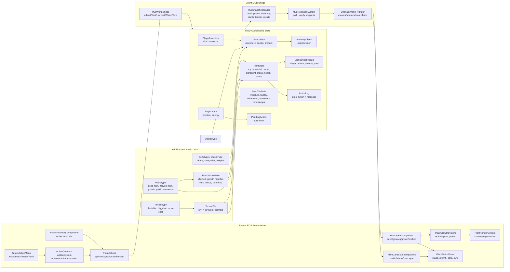
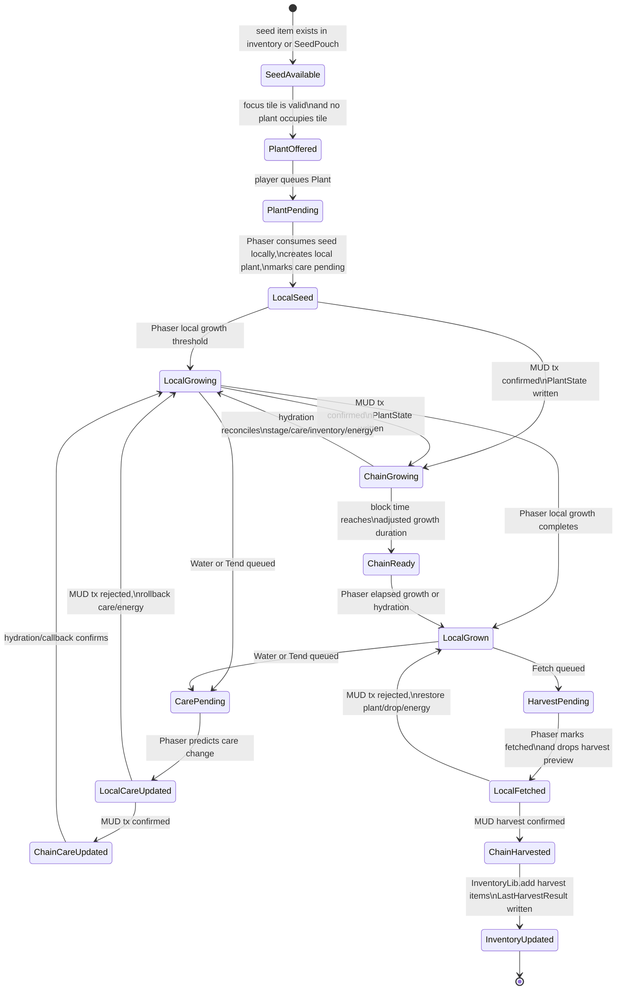
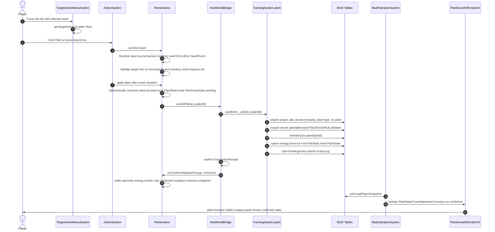
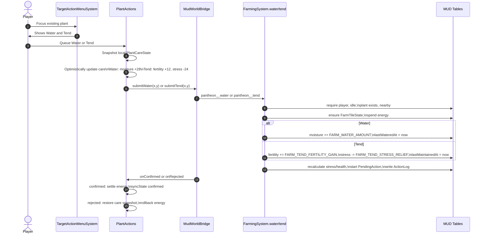
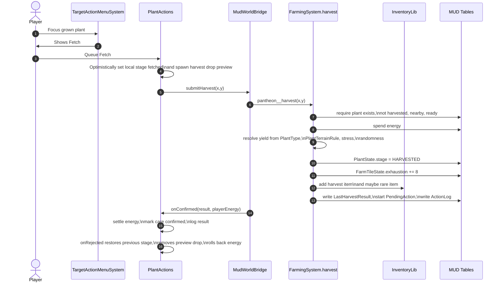
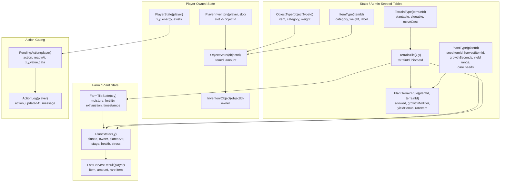
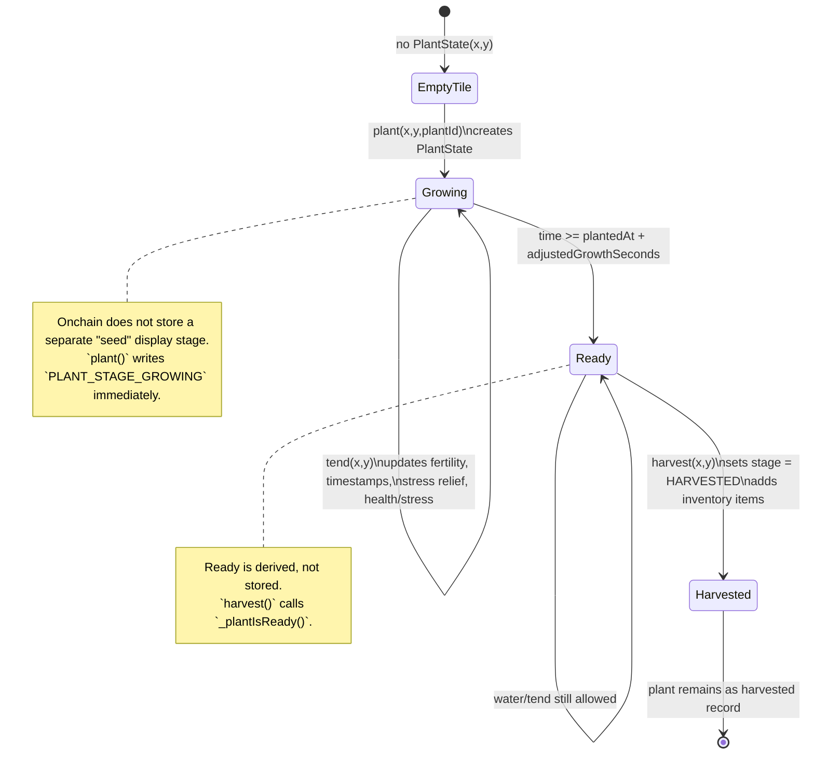
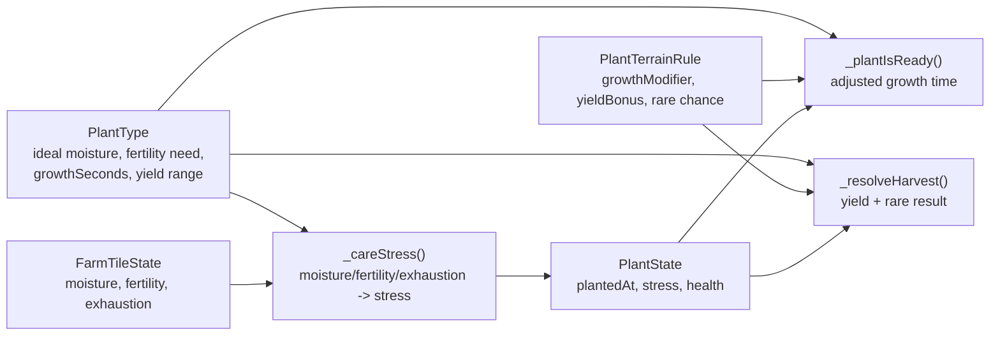

# Plant System Lifecycle

This diagram maps the plant lifecycle across the authoritative MUD contracts and
the Phaser client presentation layer. The onchain layer owns truth for terrain,
inventory, energy, care, harvest results, and final acceptance. Phaser keeps the
game responsive by predicting the visible result, then reconciling from MUD
confirmation callbacks and periodic hydration.

## Whole System Map

## Lifecycle State Machine

## Plant Transaction Sequence

## Care Sequence: Water and Tend

## Harvest Sequence

## Contract Responsibilities

| Area | Contract/table | Responsibility |
| --- | --- | --- |
| Plant definitions | `PlantType` | Seed item, harvest item, growth seconds, yield range, maintenance interval, moisture range, fertility need, label. |
| Terrain compatibility | `TerrainType`, `TerrainTile`, `PlantTerrainRule` | A tile must exist, be plantable, and be allowed for the plant. Terrain rules can modify growth, yield, and rare drops. |
| Plant state | `PlantState` | Authoritative plant record keyed by `x,y`: plant id, owner, planted time, stage, health, stress, maintenance timestamp. |
| Tile care | `FarmTileState` | Moisture, fertility, exhaustion, last maintained/watered timestamps. Created lazily by planting/care. |
| Inventory | `PlayerInventory`, `ObjectState`, `InventoryObject`, `InventoryLib` | Seeds are spent during planting; harvest and rare items are added during harvest. |
| Player action gating | `PlayerState`, `PendingAction`, `ActionLog` | Validates player exists, action is idle, player is nearby; spends energy; records busy duration and message. |
| Harvest result | `LastHarvestResult` | Stores the latest harvest payload so the client can report confirmed item/amount/rare drop. |

## Onchain Core Model

This is the plant system with the client removed. The core contract concept is:
plant records live at terrain coordinates, while plant definitions, terrain
rules, farm tile care, inventory, and player energy constrain how those records
can be created or changed.

### Onchain Plant State Machine

### Onchain Action Rules

| Action | Preconditions | State writes | Result |
| --- | --- | --- | --- |
| `plant(x,y,plantId)` | Player exists, pending action resolved, player idle, terrain tile exists, player within 1 tile, plant type exists, no `PlantState(x,y)`, terrain is plantable, plant terrain rule allows it, player has seed item. | `InventoryLib.spend(seed)`, player energy spend, lazy `FarmTileState`, `PlantState.set(...)`, `PendingAction.startBusy`, `ActionLog.write`. | A new authoritative plant exists at `x,y` with owner, planted time, health, stress, and growing stage. |
| `water(x,y)` | Player exists, idle, plant exists, player within 1 tile. | Lazy `FarmTileState`, energy spend, moisture increase, `lastWateredAt`, recalculated plant health/stress, `PendingAction`, `ActionLog`. | Tile moisture improves and plant care is recalculated. |
| `tend(x,y)` | Player exists, idle, plant exists, player within 1 tile. | Lazy `FarmTileState`, energy spend, fertility increase, last maintained timestamps, stress relief, recalculated health/stress, `PendingAction`, `ActionLog`. | Fertility/maintenance improves and stress is reduced. |
| `harvest(x,y)` | Player exists, idle, plant exists, player within 1 tile, plant is not harvested, `_plantIsReady()` returns true. | Energy spend, yield resolution, `PlantState.stage = HARVESTED`, farm exhaustion increase, `InventoryLib.add(...)`, `LastHarvestResult`, `PendingAction`, `ActionLog`. | Harvest items, and maybe rare items, are added to inventory. |

### Derived Values

- Readiness is not stored. It is computed at harvest time as
  `plantedAt + adjustedGrowthSeconds`, where `adjustedGrowthSeconds` comes from
  `PlantType.growthSeconds` and optional `PlantTerrainRule.growthModifier`.
- Stress is recomputed from tile exhaustion, moisture outside the plant's ideal
  range, and fertility below the plant's need.
- Health is `100 - stress`.
- Harvest yield starts from the plant type's min/max range, then receives terrain
  yield bonus, stress penalty or low-stress bonus, and optional rare item roll.
- Harvested plants are not deleted. The record remains with stage
  `PLANT_STAGE_HARVESTED`.

## Phaser Responsibilities

| Area | File/component | Responsibility |
| --- | --- | --- |
| Action discovery | `ActionAvailability.ts`, `TargetActionMenuSystem.ts` | Decides which actions appear for a focused tile/object. Plant appears for an available seed source and an unoccupied target. |
| Action ordering | `ActionQueue`, `ActionSystem` | Preserves intent order and waits for movement reconciliation before starting queued actions. |
| Plant action bridge | `PlantActions.ts` | Performs optimistic plant, fetch, water, and tend behavior; submits MUD transactions; rolls back rejected actions. |
| MUD bridge | `MudWorldBridge.ts` | Sends `pantheon__plant`, `pantheon__harvest`, `pantheon__water`, `pantheon__tend`; tracks pending keys to avoid duplicate submissions. |
| Snapshot reading | `MudSnapshotReader.ts` | Reads player energy, inventory, world terrain, plants, and last harvest result after confirmations or polling. |
| Hydration | `MudHydrationSystem.ts`, `OnchainWorldHydrator.ts` | Applies authoritative snapshots into local ECS plants, care, inventory, terrain, and presentation state. |
| Local growth | `PlantGrowthSystem.ts` | Advances visual stages from `seed` to `growing` to `grown` using local elapsed time. |
| Rendering/status | `PlantRenderSystem.ts`, `PlantStatusPanelSystem.ts` | Displays sprite stage, growth progress, care values, and sync state. |

## Important Notes

- Onchain `FarmingSystem.plant` writes `PlantState.stage = PLANT_STAGE_GROWING`.
  Phaser may briefly show a local `seed` stage before MUD confirmation or
  hydration maps the onchain plant back to local `growing`.
- Onchain harvest readiness uses `PlantTerrainRule.growthModifier`; the Phaser
  local growth display currently uses the base client `growthSeconds`. That can
  make a plant look locally ready before or after the contract accepts harvest on
  special terrain.
- Onchain care truth includes `FarmTileState.moisture/fertility/exhaustion` and
  `PlantState.health/stress`. The current plant snapshot hydrates local
  `health/stress`; local `moisture/fertility` may be optimistic/default unless
  separately hydrated.
- Inventory seeds are authoritative onchain. Phaser consumes the selected seed
  optimistically, then replaces inventory from the confirmation snapshot or
  restores the previous slot on rejection.
- `Fetch` is the UI label for harvest. It maps to `pantheon__harvest` onchain.
