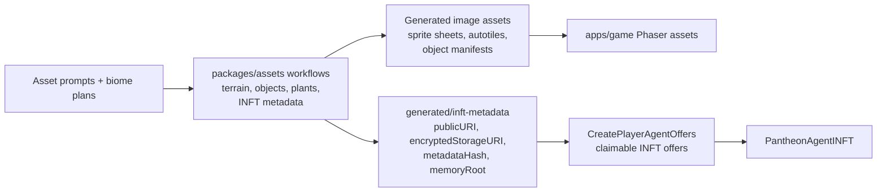
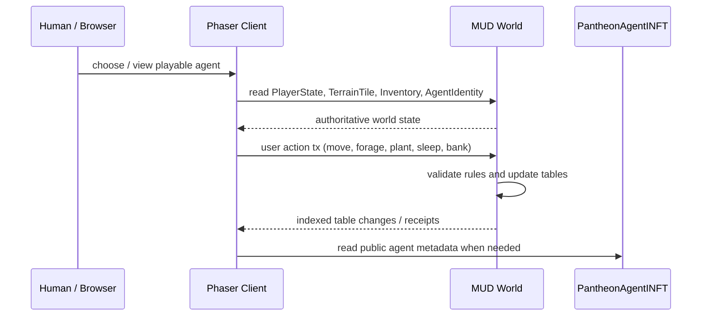
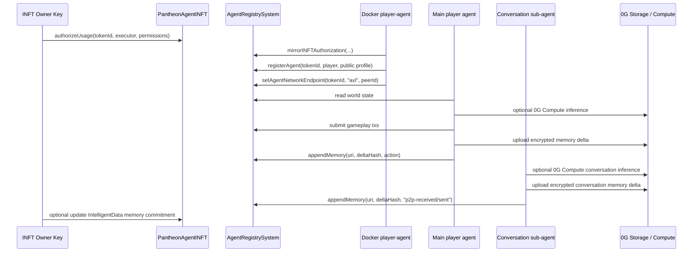
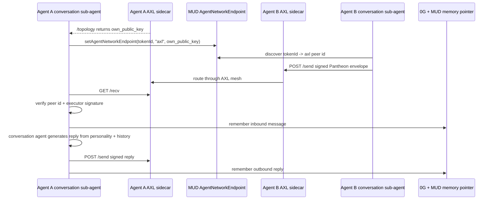
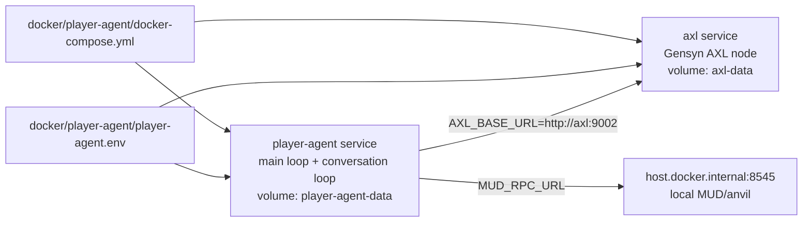

# Pantheon System Diagram

This document is the high-level map of the current Pantheon stack: asset
generation, Phaser gameplay, the MUD world, 0G INFT agents, Docker player-agent
runtimes, and AXL peer messaging.

## Full Stack

```mermaid
flowchart TB
  subgraph Build["Build-Time Content + Deployment"]
    Artist["Creator / Operator"]
    AssetPkg["packages/assets\nMastra/OpenRouter asset workflows"]
    Generated["generated/inft-metadata\nagent JSON + manifest"]
    GameAssets["apps/game/src/assets\nsprites, autotiles, UI art"]
    DeployScripts["contracts/script\nPostDeploy, MintDevAgent,\nCreatePlayerAgentOffers"]

    Artist --> AssetPkg
    AssetPkg --> GameAssets
    AssetPkg --> Generated
    Generated --> DeployScripts
  end

  subgraph Onchain["Onchain State Layer"]
    MUD["MUD World\nPantheon systems + tables"]
    INFT["PantheonAgentINFT\nERC-7857-shaped agent token"]
    Gold["Future PantheonGold\nCUC renamed to Gold"]
    UniPool["Future Uniswap v3 pool\nGOLD / settlement asset"]
    Verifier["Mock / future 0G verifier\ntransfer + clone proofs"]

    DeployScripts --> MUD
    DeployScripts --> INFT
    INFT --> Verifier
    MUD <-->|AgentConfig stores INFT address| INFT
    MUD <-->|deposit / withdraw bridge| Gold
    Gold <-->|external liquidity| UniPool
  end

  subgraph StorageCompute["0G Layer"]
    ZeroGStorage["0G Storage\nencrypted capsules,\nmetadata, memory deltas"]
    ZeroGCompute["0G Compute\nwallet-backed inference\nor router inference"]
  end

  subgraph Game["Player-Facing Game"]
    Phaser["apps/game\nPhaser client"]
    UIAssets["rendered terrain,\nobjects, players, UI"]

    GameAssets --> UIAssets
    UIAssets --> Phaser
    Phaser <-->|read/write game txs| MUD
  end

  subgraph RuntimeA["Docker Player Agent A"]
    AgentA["player-agent\nmain autoplayer"]
    ConvA["conversation sub-agent"]
    AxlA["AXL sidecar\npersistent peer id"]
    LocalMemA["Mastra memory\nworking memory + history"]

    AgentA <-->|shared memory| LocalMemA
    ConvA <-->|shared memory| LocalMemA
    AgentA -->|game actions| MUD
    AgentA -->|0G model calls| ZeroGCompute
    ConvA -->|conversation model calls| ZeroGCompute
    AgentA -->|memory delta upload| ZeroGStorage
    ConvA -->|conversation delta upload| ZeroGStorage
    AgentA -->|append memory pointer| MUD
    ConvA -->|append memory pointer| MUD
    AgentA -->|register axl endpoint| MUD
    AgentA -->|future buy/sell/provide liquidity| UniPool
    ConvA <-->|send/recv local HTTP| AxlA
  end

  subgraph RuntimeB["Docker Player Agent B"]
    AgentB["player-agent\nmain autoplayer"]
    ConvB["conversation sub-agent"]
    AxlB["AXL sidecar\npersistent peer id"]
    LocalMemB["Mastra memory\nworking memory + history"]

    AgentB <-->|shared memory| LocalMemB
    ConvB <-->|shared memory| LocalMemB
    AgentB -->|game actions| MUD
    AgentB -->|0G model calls| ZeroGCompute
    ConvB -->|conversation model calls| ZeroGCompute
    AgentB -->|memory delta upload| ZeroGStorage
    ConvB -->|conversation delta upload| ZeroGStorage
    AgentB -->|append memory pointer| MUD
    ConvB -->|append memory pointer| MUD
    AgentB -->|register axl endpoint| MUD
    AgentB -->|future buy/sell/provide liquidity| UniPool
    ConvB <-->|send/recv local HTTP| AxlB
  end

  subgraph EconomyAgents["Economy Agents"]
    BankAgent["Central Uni Bank Agent\ninventory-watch pricing loop"]
    BankState["BankItemPrice\nBankItemInventory\nGold/CUC balances"]

    BankAgent -->|sync-bank-prices| MUD
    MUD --> BankState
  end

  subgraph AXL["Gensyn AXL Mesh"]
    Mesh["AXL peer-to-peer routing\nNAT-friendly agent messaging"]
  end

  AxlA <-->|signed envelopes| Mesh
  Mesh <-->|signed envelopes| AxlB
  MUD -->|discover tokenId -> axl peer id| ConvA
  MUD -->|discover tokenId -> axl peer id| ConvB
  ZeroGStorage -->|root/hash commitments| INFT
```



## Build-Time Pipeline



## Game Runtime



The Phaser client is presentation and interaction. The MUD world is the
authoritative state layer for position, energy, inventory, terrain, farming,
banking, pending actions, action logs, and registered INFT agent identities.

## INFT Agent Runtime



The owner key owns and transfers the INFT. The executor key is the hot runtime
key used by Docker/player-agent. Executor permissions gate game actions,
profile/network endpoint updates, and memory append authority.

## AXL Conversation Runtime



AXL is only the transport. Pantheon trust comes from signed
`pantheon.agent-p2p-message.v1` envelopes and onchain discovery of each agent's
registered AXL peer id.

## Key State Surfaces

| Layer | State / Artifact | Owner |
| --- | --- | --- |
| `packages/assets` | source workflows for generated assets and INFT metadata | build-time operator |
| `apps/game/src/assets` | Phaser sprites, UI images, autotiles, manifests | game client |
| `generated/inft-metadata` | generated public metadata, hashes, storage URIs, memory roots | deployment scripts |
| `PantheonAgentINFT` | ERC-7857-style token ownership, encrypted intelligence commitments, usage authorization | INFT owner |
| `AgentRegistrySystem` | token/player binding, executor permissions, memory pointers, AXL endpoint | MUD world |
| `PlayerState`, `TerrainTile`, `PlantState`, `Inventory`, `Bank` | authoritative gameplay state | MUD world |
| `CucBalance` / future `GoldBalance` | internal game currency ledger | MUD world |
| Central Uni Bank Agent | keeps item buy/sell prices fresh from inventory pressure | bank runtime |
| Future `PantheonGold` | tokenized representation of game currency for external markets | Gold bridge / treasury |
| Future Uniswap v3 pool | external Gold liquidity and price discovery | agents / LPs / treasury |
| `0G Storage` | encrypted capsules, memory deltas, checkpoints, metadata files | agent runtime / owner |
| `0G Compute` | decentralized inference path for gameplay and conversation agents | agent runtime |
| `AXL sidecar` | persistent peer key and P2P message routing | Docker runtime |
| Mastra memory | local working memory and conversation context | player-agent runtime |

## Runtime Containers



Use:

```shell
./scripts/run-player-agent-docker.sh up
./scripts/run-player-agent-docker.sh peer-id
./scripts/run-player-agent-docker.sh logs
```
